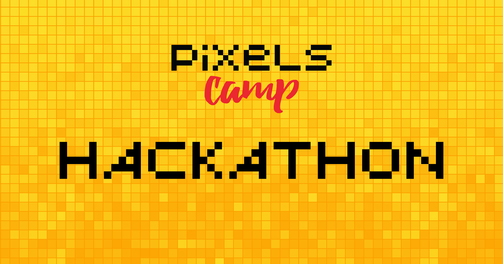

# Pixels Camp Hackathon

The goal of the Pixels Camp hackathon is to single out and reward creativity and innovation by providing participants with an opportunity to work together within a time frame of 48 hours to create something awesome.

The Hackathon is an important part of the event. Every candidate is advised to put a team together a take part in it. Participation is what makes Pixels Camp great. The more we have evidence that you participated in the hackathon and other activities, the more your chances of joining us next year improve.

We don't expect you to come to Pixels Camp to attend a few talks, that's not the spirit. We expect you to join us for three days, all-in, participate, communicate, learn and teach, and network with the community.

Now...

## What's changing this year?

This year we decided to break with our classical approach to find the best hackathon projects based on a voting system and try something entirely new. Something that's never been done before.

Based on the principles of full decentralization and transparency that blockchain technologies promise, we've decided to make everything about Pixels Camp, including picking up the winning projects of this year's Hackathon, completely based on the dynamics of what you can find in the real world and a real economy.

For this, we've created a digital coin, called [Exposure][6], which will be used for nearly all activities around the Pixels Camp event and community. You can read more Exposure and how to start using our coin here. In fact, you should do it as soon as possible.

In a nutshell, this year every participant is an entrepreneur, an investor, a service provider, a customer,  a marketing guy, a growth strategist, a CTO looking for help, a mentor and a trader.

The best will hopefully emerge from this equilibrium, and the incentives we've put in place, just like the best usually thrive in the real world.

So here's what changed:

* There is no more jury. Instead, now we will have Angels. People we invite to live the Pixels Camp experience. They have more money than most and will invest in the projects they think deserve it.

* There is no more voting system. Putting your hard earned money, also known as Exposure, or simply EXPs, in the projects you love,  is your vote.

* Every investment in a project, either coming from Angels, its team members, good friends or general participants will be entirely traceable, transparent and incorruptible, by design.

* You can invest in a project, at the beginning, middle or at the end of Pixels Camp, when the projects are presented. It's up to you to define your strategy. We will teach you to do it, and provide you with tools to make it as easy as possible.

* Investing in real time during the projects presentation session is hard. Instead, we built a page where you can take quick notes and tick your favorite projects as you get to know them. In the end, just before the winners are announced, you can quickly decide where to invest the rest of your precious EXPs.

For the rest of the rules and incentives, read the [Equilibrium section][5] of the detailed Exposure page.

Sounds complicated? It is a little bit. But it's also highly interesting to see how this experiment plays out in such a vibrant and active tech-savvy event like Pixels Camp. Plus, you get to learn a lot about blockchain, market dynamics, and game theory. And in the end, all the data is yours, for you to keep exploring and learning from it.

To make it less complicated, one of the first sessions in the calendar will a full talk on Exposure and the new rules, on the main stage, at 2 PM, with Q&A.

Let's get started with the Hackathon rules now.

## Eligibility

Any Pixels Camp approved participant can apply, as long as they are on the premises during those 48 hours (within reason – you are allowed to go out and get some air, sleep in a proper bed if you want to, etc.)

Groups __must be larger than 2 elements__, all of whom must be Pixels Camp participants. Teams are advised to recruit elements with a wide diversity of interests that complement each other in their knowledge areas. The broader the skills in a team, the higher the probabilities to surprise the angels, investors and your peers with innovative ideas.

To find your team members you can use [Slack][2] or [Twitter][3] to speak out to other participants, or you can meet them IRL on site when Pixels Camp starts.

__Participants can only join one project at a time__.

Ideas, concepts, and team organization are tasks that can be thought out before the event, but the project itself should be developed during the 48 hour period.

## Schedule

The programming event will last exactly 48 hours, starting on the first day. You can see the full schedule [here](https://pixels.camp/schedule/).

## Project Registration

WIP

[2]: https://github.com/PixelsCamp/docs/blob/master/SLACK.md
[3]: https://twitter.com/pixelscamp
[4]: https://github.com/PixelsCamp/projects/blob/master/nobull_bot.md
[5]: https://github.com/PixelsCamp/moon#equilibrium
[6]: https://github.com/PixelsCamp/moon
