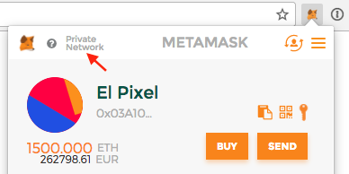
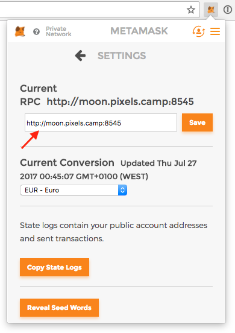
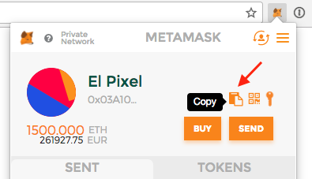
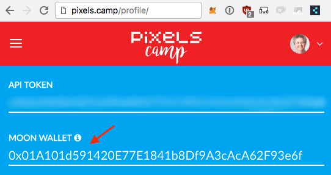

# The Moon Ethereum Testnet

This year's Pixels Camp is going full steam on experimenting with blockchain, and we want the whole community to join us and be part of the action.

So we've decided to build the playground infrastructure precisely for that. Meet our Moon Ethereum Testnet.

We decided to go with [Ethereum][1] because it adds a distributed computing platform to the blockchain, which opens the door to a broad number of applications and innovation on top of it, and we think it's the perfect setup for what we want to do.

If you want to know more about Ethereum, we suggest you start here:

 - [Main website][1]
 - [What is ether][2]
 - [A 101 Noob Intro to Programming Smart Contracts on Ethereum][3]
 - [Contract tutorial][4]

The Moon Ethereum test network is now up and running. You can connect your favorite client to it, get free ethers and start coding, deploying smart contracts, trading or whatever you feel in the mood to do with it.

The RPC address is http://moon.pixels.camp:8545

## Our soon to be announced token

We're working to deploy a special token in this test network, managed by a smart contrat we're now testing. Like the badges system, this token will be issued to participants in the proportion of their activity. You'll be able to stuff with it at the event. It will be both fun and useful.

It will be called... well, it's a surprise. More on this real soon.

Meanwhile, here's how you can get your own testnet address and earn free ether to start learning and playing.

## Creating an account

To create an account, you have plenty of options.

The simpliest way we know is by using [MetaMask][6], a Chrome extension that provides an identity vault and a connection to an Ethereum network, public or private.

Click [here][5] to install the extension in Chrome.

Once installed, open MetaMask and create a new vault. By default, the vault will be connected to the Ropsten Test Network.

Now click on the top left as it shows in the image and then choose `Custom RPC`.

Now add `http://moon.pixels.camp:8545` to the RPC address field.

That's it. You're now connected to our testnet, and you have your own Ethereum address.

## Get some Ether

To get 1000 free ethers, you need to update your Pixels Camp user profile.

First open Metamask again, and copy your public Ethereum address to the clipboard.

Now login to your [Pixels Camp account][7] and edit your profile. You'll find a "Moon Wallet" field. Copy your ethereum address and press enter.

Go back to Metamask and watch. In 1-2 minutes your wallet will show that you own 1000 ethers.

You're ready.

## Blockchain explorer

We provide a public Blockchain explorer at [http://moon.pixels.camp:8547/][9].

It's based on [Etherchain Light][10]. You can use it to browse blocks, transactions, accounts and contracts, upload & verify contract sources and much more.

## Questions?

Use [Slack][8], channel `#blockchain`. We'll be around.

## Network settings

This private Ethereum network is mined by our servers and creates a new block every ~1 minute.

[1]: https://ethereum.org/
[2]: https://ethereum.org/ether
[3]: http://consensys.github.io/developers/articles/101-noob-intro/
[4]: https://github.com/ethereum/go-ethereum/wiki/Contract-Tutorial
[5]: https://chrome.google.com/webstore/detail/metamask/nkbihfbeogaeaoehlefnkodbefgpgknn
[6]: https://metamask.io/
[7]: https://pixels.camp/
[8]: https://github.com/PixelsCamp/docs/blob/master/SLACK.md
[9]: http://moon.pixels.camp:8547/
[10]: https://github.com/gobitfly/etherchain-light
